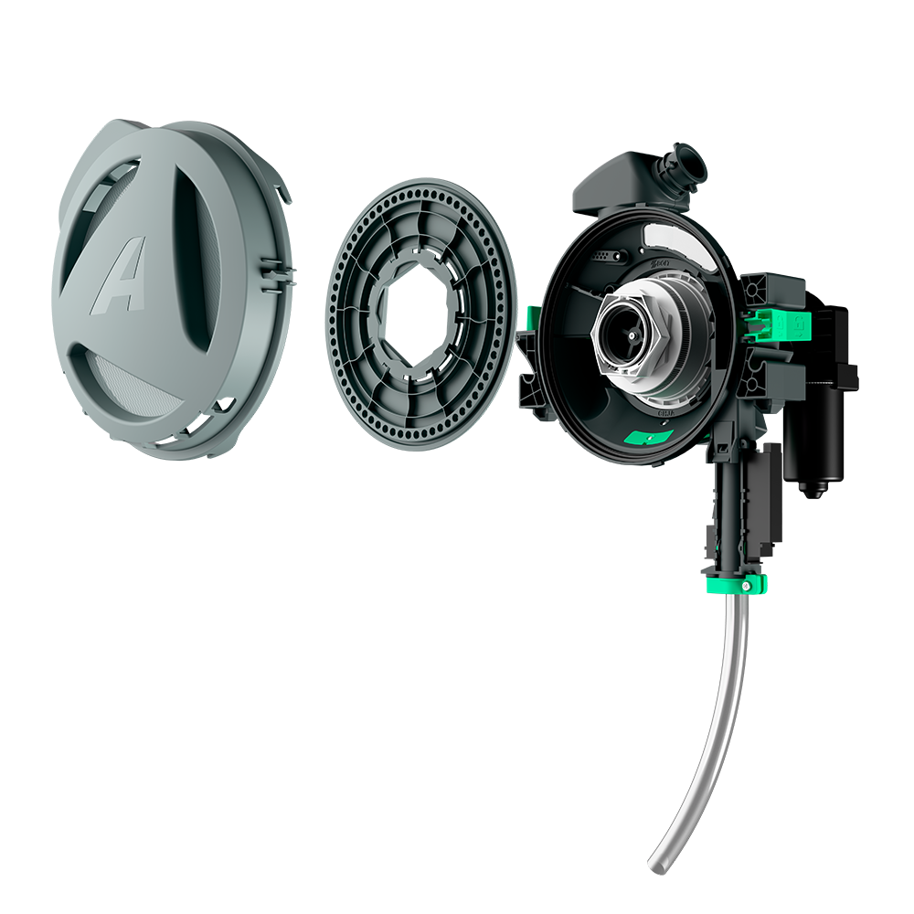
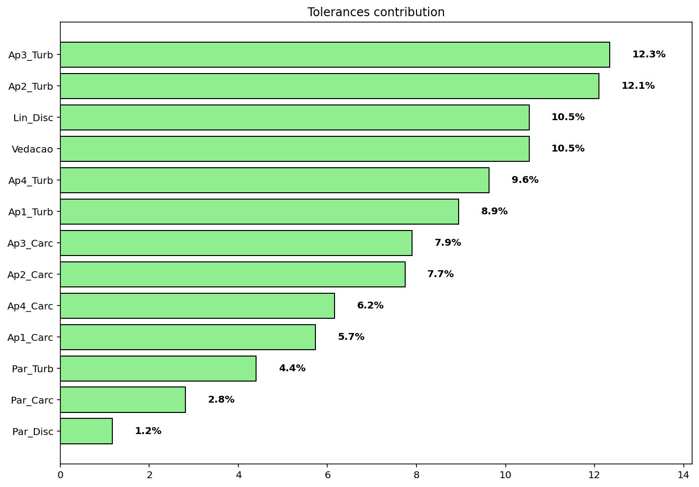

# pneumatic-seed-meter-design-and-statistical-stackup
Complete mechanical development of a seed metering system, from high-complexity CAD modeling to 3D statistical tolerance analysis using CETOL 6σ and custom Python scripts
# Precision Seed Meter: Full Product Development & Statistical Tolerance Analysis

This repository showcases the end-to-end mechanical development of a high-precision seed metering system. The project integrates advanced 3D CAD modeling, Design for Manufacturing (DFM), and rigorous statistical validation to ensure vacuum sealing and operational reliability.

## 🛠 Project Scope

1.  **3D CAD Design (SoliWorks):** Complete modeling of high-complexity plastic injection components, focusing on seed flow optimization and mechanical integration.
2.  **GD&T & Technical Detailing:** Application of ASME Y14.5 standards to ensure assembly interchangeability and tight sealing interfaces.
3.  **Statistical Tolerance Stack-up:**
    * Initial analysis performed using **CETOL 6σ**.
    * Development of a proprietary **Python-based Monte Carlo Simulation** to validate assembly yield and sealing gaps after commercial license expiration.

---

## 📊 Engineering Methodology & Visual Validation

The critical challenge was ensuring a hermetic seal in the meter housing. A small deviation in the injection molding process could lead to vacuum loss, affecting planting precision.

### 1. Mechanical Assembly (CAD)
The system was designed for high durability and field performance, utilizing complex geometries for seed singulation.

  
   <em>Figure 1: Exploded view of the Seed Meter assembly.</em>

### 2. Statistical Analysis & Yield Prediction
Using a custom Python script, I performed **Monte Carlo Simulations** (10,000+ iterations) to predict how manufacturing variations affect the final assembly gap.

  
  
  
   <em>Figure 2: Statistical outputs showing Compression Histogram, Gap Distribution, and Pareto Sensitivity Analysis.</em>

* **Compression Histogram:** Validation of sealing pressure limits.
* **Gap Distribution:** Visualization of the probability density for the critical sealing interface.
* **Pareto Chart:** Identification of the "Critical-to-Quality" (CTQ) dimensions that most influence assembly variation.

### 3. Advanced Failure Mapping
I developed a spatial failure map to visualize the probability of leaks across the sealing perimeter, allowing for targeted mold adjustments.

  
   <em>Figure 3: Polar Failure Map identifying critical leakage zones.</em>

---

## 💻 Tech Stack
* **CAD/PLM:** Inventor (Expert/Book Author), SolidWorks.
* **Simulation & Math:** Python (NumPy, Matplotlib), CETOL 6σ, Excel/VBA.
* **Manufacturing:** Plastic Injection Molding, GD&T (ASME Y14.5).

---
*Note: Technical drawings and proprietary CAD data are omitted due to non-disclosure agreements (NDA). The focus here is on the engineering methodology and data-driven problem-solving approach.*
